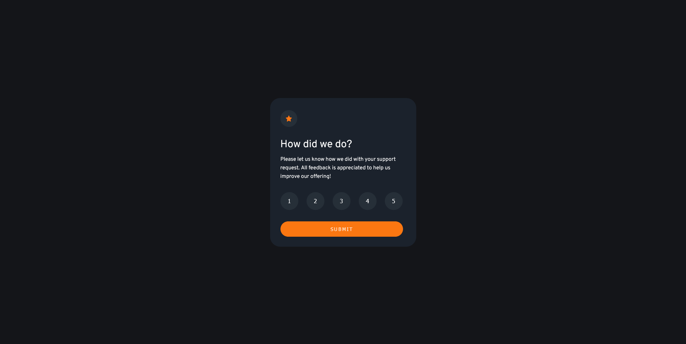
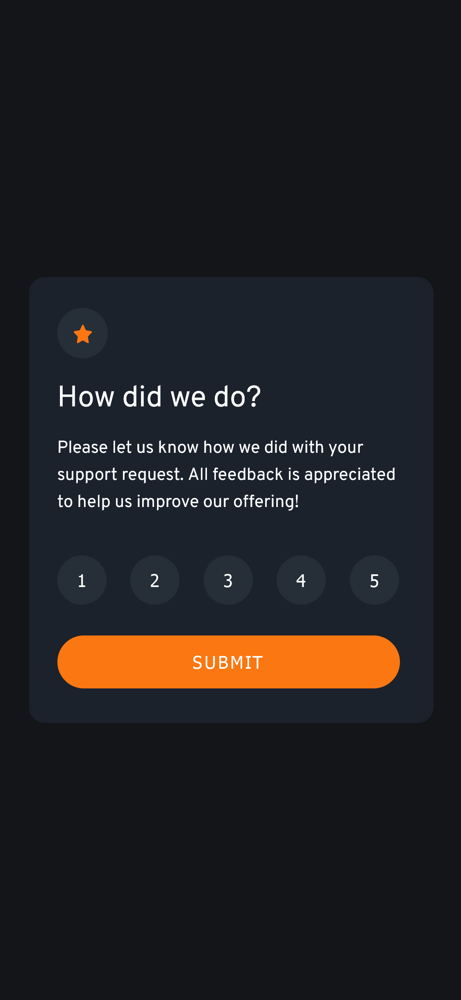
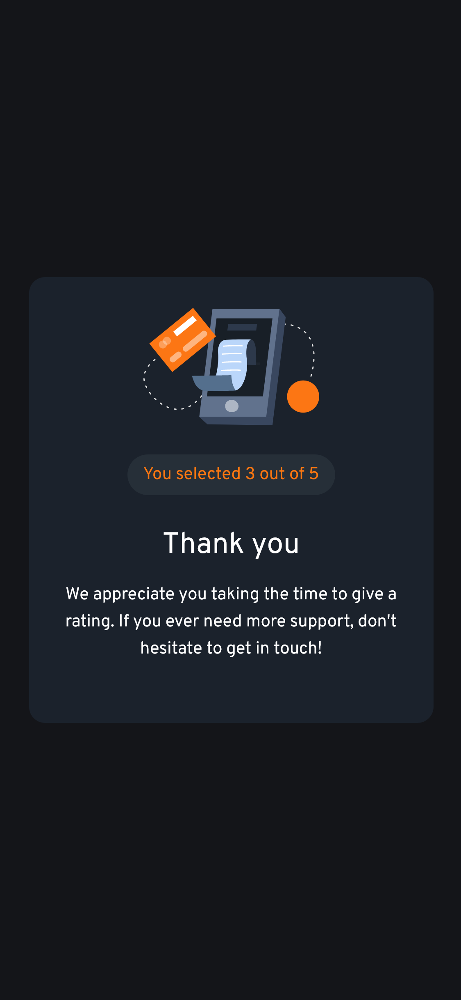

# Frontend Mentor - Interactive rating component solution

This is a solution to the [Interactive rating component challenge on Frontend Mentor](https://www.frontendmentor.io/challenges/interactive-rating-component-koxpeBUmI). Frontend Mentor challenges help you improve your coding skills by building realistic projects. 

## Table of contents

- [Overview](#overview)
  - [The challenge](#the-challenge)
  - [Screenshot](#screenshot)
  - [Links](#links)
- [My process](#my-process)
  - [Built with](#built-with)
  - [What I learned](#what-i-learned)
  - [Continued development](#continued-development)
  - [Useful resources](#useful-resources)
- [Author](#author)


## Overview

### The challenge

Users should be able to:

- View the optimal layout for the app depending on their device's screen size
- See hover states for all interactive elements on the page
- Select and submit a number rating
- See the "Thank you" card state after submitting a rating
- If no rating is selected the submit button would be disabled

### Screenshot






### Links

- Solution URL: [Github solution URL here](https://github.com/tchydy/Interactive-rating-component)
- Live Site URL: [ live site URL here](https://tchydy.github.io/Interactive-rating-component/)

## My process

### Built with

- Semantic HTML5 markup
- CSS custom properties
- Flexbox
- CSS Grid
- Mobile-first workflow


### What I learned

For some reason i could not get get hiding one container and showing another simultaneously to work as I thought. hmmm

culprit found css was not working because i used 
```css
.thankyou-card-container .hide 
```
with a space between instead of this
```css
.thankyou-card-container.hide 
```
That slight difference made the code fail. 
Another logic I encountered was if no score is selected what happens. I made the button disabled.

To see how you can add code snippets, see below:


### Continued development

- Would love to add animations to the elements on load.
- Add jiggle animation when no sore is selected on submit

### Useful resources

- [event.target.id VS event.currentTarget.id VS this.id](https://stackoverflow.com/questions/32456290/event-target-id-vs-event-currenttarget-id-vs-this-id) - I wanted to know the differences between them and use cases this thread helped.
- [Check for null in JavaScript](https://javascript.plainenglish.io/how-to-check-for-null-in-javascript-dffab64d8ed5) - I was not sure what equality to use in this instance so this article helped.


## Author

- Frontend Mentor - [@tchydy](https://www.frontendmentor.io/profile/tchydy)


